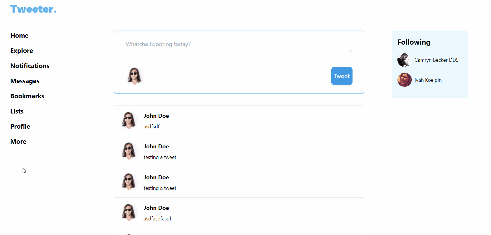

# Tweeter


<br>

This was originally built a couple months after completing a bootcamp in Oct, 2020. The project was aimed at just consolidating my experience and built using Laravel and TailwindCSS. 

I've revisited this in Dec, 2021 to dockerise the application and create a CI pipeline for it using GitHub Actions. 



## Installation

### Pre-requisites
You'll require the following dependencies:

- Docker Engine ^20.10.12
- Docker Compose ^1.18.0

### Pull the repository

```bash
git clone git@github.com:daniel-norris/tweeter.git tweeter
```

### Populate the .env

```bash
cp .env.example .env

# fill out the following variables
# create any username or leave the default 'tweeter'
DB_USERNAME=
# set a password for the mysql user above
DB_PASSWORD=
# a root password you'll use to grant privileges to user above
DB_ROOT_PASSWORD=
```

### Start the containers
This will take a while on first run to build the app container.

```bash
docker-compose up -d
```

### Install dependencies

```bash
# install composer dependencies
./run composer install

# install npm dependencies
./npm install

```

### Generate an app key

```bash
./run php artisan key:generate
```

### Create a non-root MySQL user

```bash
docker-compose exec db bash

# run the following once in a bash shell in your db container
# enter the root password you set earlier when prompted
mysql -u root -p

# grant your tweeter user privileges to the tweeter db
grant all on tweeter.* to '<DB_USERNAME>'@'%' identified by '<DB_PASSWORD>';

# flush privileges to set the changes
flush privileges

exit
```

### Run the migrations

```bash
./run php artisan migrate
```

### View the app
Visit the app at `http://your_server_ip`.

## Scripts
The `run` and `npm` bash scripts are wrappers for the docker-compose exec command. 

Composer and Artisan or any docker-compose command can be run on the PHP ('app') container using, e.g.:
`./run composer install | update`

Npm or any docker-compose command can be run on the Node ('node') container using, e.g.:
`./npm install`

## GitHub pipelines
The project currently has a single job defined in GitHub actions: 

- Tests: which runs a Ubuntu runner and runs PHPUnit tests to ensure that all tests are passing (the app needs test coverage)

I'm planning to find a new hosting solution for this project (potentially ECS on AWS), previously it was just running on an EC2 instance on AWS. However, for the time being, there is no deployment step at the moment. 